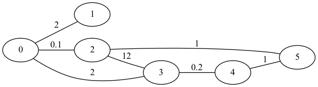
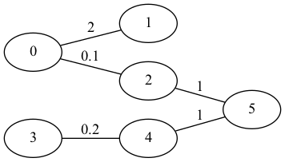

# Minimum spanning tree

We haven't covered graph algorithms in this class, but I think you already have some idea of what a graph is, in the mathematical sense.

You have some set of *nodes* also called *vertices* and a set of *edges* connecting them. For nodes `a` and `b` we sometimes write an edge connecting `a` to `b` as `(a,b)`. A graph is *directed* if the order matters here. If `(a,b)` means that same as `(b,a)`, i.e. the is a connection from `a` to `b` if and only if there is also a connection from `b` to `a`, then the graph is *undirected*. We can associate *weights* to edges, `w`, and write this as `(a,w,b)`, and then we have a *weighted graph*. Any algorithm that works on weighted graphs will also work on unweighted graphs, of course, since you can always assign each edge the unit weight `1` to get a weighted graph.

A *connected* graph is one where you can get from any node to any other via a set of edges. Not all graphs are connected--you can have separate sets of nodes that cannot reach each other--and then the different sets of nodes that can reach each other are called *connected components*.

A *tree* is a special type of graph where for each set of nodes you have exactly one path from one to the other. This, perhaps clumsy, defintion matches what you intuitiely think of as a tree in phylogenetics and such. A *forest* is a graph where each connected component is a tree, which simply means that all your nodes are connected, but if they are, there is only one path between them. It is just a set of trees.

A classical computational problem is computing the [minimum spanning tree](https://en.wikipedia.org/wiki/Minimum_spanning_tree) of a connected graph. (If the graph is not connected you can build a minimal spanning forest instead). A minimal spanning tree is where you take a graph, then you pick a sub-set of the edges such that all nodes are connected in a tree, and such that the weight on those edges have the minimal sum possible. This problem has applications in several bioinformatics problem, and Storm has a PiB that uses it to construct multiple sequence alignments, if you are interested in that kind of stuff.

[Prim's algorithm](https://en.wikipedia.org/wiki/Prim%27s_algorithm) solves the problem in a simple way. You grow an initial tree, consisting of one arbitrarily chosen node, edge by edge, where each time you add an edge to the tree you pick an edge that connects any node in the tree to an edge outside of it, and you pick one with minimal weight.

For example, say we start with this graph:



We can start with node 0, it is as good a node as any. Put it in the tree and consider the edges out of the tree (which now are only the edges out of 0)

```
0 -2.0-> 1
0 -0.1-> 2
0 -2.0-> 3
```

Of these, `(0,0.1,2)` is the one with the smallest weight, so we pick it and add it to the tree, which now has nodes `{0,2}`. The edges out of the tree are then

```
0 -2.0-> 1
0 -2.0-> 3
2 -12.-> 3
2 -1.0-> 5
```

There are two edges to `3` but that doesn't bother us. We just want the smallest. And the smallest edge out of the tree is `(2,1.0,5)`, so the next edge we add to the tree is this, and now the edges going out of the tree are

```
0 -2.0-> 1
0 -2.0-> 3
2 -12.-> 3
5 -1.0-> 4
```

and the next edge we add is `(4,1.0,5)`. That gives us the out-edges

```
0 -2.0-> 1
0 -2.0-> 3
2 -12.-> 3
4 -0.2-> 3
```

where we pick the edge from `4` to `3` which leaves us

```
0 -2.0-> 1
```

and when we pick that edge we have connected all the nodes into a tree:



## A quadratic time algorithm

You can implement this algorithm in various ways. A simple approach, that I have implemented for you in `src/prim_quadratic.py`, represents the graph as a matrix[^1] `E` where, for nodes `i` and `j`, `E[i,j]` is the weight to go from `i` to `j`, or `∞` if there is no edge between `i` and `j`. You use a vector of weights, `dist`, where `dist[i]` gives you the cost of going from the tree to node `i` (with `distt[i] = ∞` if `i` is already in the tree). If we pick node `0` as the initial node, then `dist = E[0,:]` is the initial vector. We use another vector, `src` to keep track of which source node you need to take out of the tree to get there in that distance. 

Then, in each iteration, we go through `dist` to find the minimal value and the index `i` it sits at. Once we have it, `(src[i],dist[i],i)` is the new edge we add to the tree, and we update `dist` and `src` by replacing the values if there is an edge out of `i` that gives us a shorter distance.

If the graph has `v` nodes, we run for `v` iterations until we have added all the nodes, and each iteration involves scanning the `dist` vector and updating `src` and `dist` in `O(n)`, so the total running time is `O(v²)`.

If the graph is dense, meaning that there are edges between most pairs of nodes, this is close to optimal. In any algorithm that computes a minimal spanning tree you need to look at all edges, and if there are `e` edges, the running time is `Ω(e)` and `e` can be `v²`. However, `v <= e <= v²` (if the graph is connected so each node is connected to at least one other), and if the graph is "sparse", `e` is much less than `v²`, and then we might do better.

## A heap of edges

Another approach is to put edges into a heap and iteratively extracting the one with the smallest weight. To get aa performance better than `O(v²)` we need a graph representation that doesn't force us to look at that many values, but you can get that by using lists of edges instead of a matrix.[^2]


Again, start with some arbitrary node and fill the heap with the edges going out of it. Then, keep extracting the edge with the minimal weight, if it goes between a node in the tree and a node outside the tree, add the edge to the tree and add the out-edges of the new node to the heap. We are once again done when all nodes are connected (whether the heap is empty or not).

In `src/prim_eloge.py` I have implemented most of this algorithm, but I need your help implementing the main loop.

Since we risk adding all the edges to the heap and extracting all of them again, the running time of this approach is `O(e log e)`.  If `e` is much less than quadratic in `v` this is an improvment, but of course it isn't if `e` is close to `v²`, in which case this would be `O(v² log v)` which is worse than `O(v²)`. 

## A heap of nodes

We can improve slightly on this approach by not putting all edges in the heap, but instead have a heap of the `v` nodes. Each will have a weight that is the cheapest way to get to the node from the current tree, and we will need to update that weight during the algorithm--i.e. we need the `decrease key` operation.

Put all the nodes in the heap with weight `∞`, or keep one selected out as the initial tree. In my implementation, `src/prim_elogv.py` I pick the first node from the heap so I start with all nodes in it. (And you need to implement the core loop that builds a minimal spanning tree). Then, until you have added all nodes to the tree, pick a node, add the edge to the tree, and update all the weights in the heap that you can reach from the new node with a smaller cost.

We still have to look at all the nodes, and potentially we need to update the keys for as many nodes, so the running time is `O((v+e)log v) = O(e log v)`. Since `O(log v²) = O(log v)` and since `e` might be `v²` this isn't a guaranted asymptotic improvement, but it can become so. 

There is a heap, called the [Fibonacci heap](https://en.wikipedia.org/wiki/Fibonacci_heap) and it implements `decrease key` in `O(1)`. If we had used that--but it is a bit more complicated to implement--then the `e` decrease min would only cost us `O(e)` and the running time becomes `O(e + v log v)`.


[^1]: This representation is called, rather appropriately, an adjacency matrix representation. Nodes do not have to be numbers between 0 and `v-1`, but it makes things easier, and it is easy to map other representations to numbers, so that is typically what we do.

[^2]: This is called an adjacency list representation.